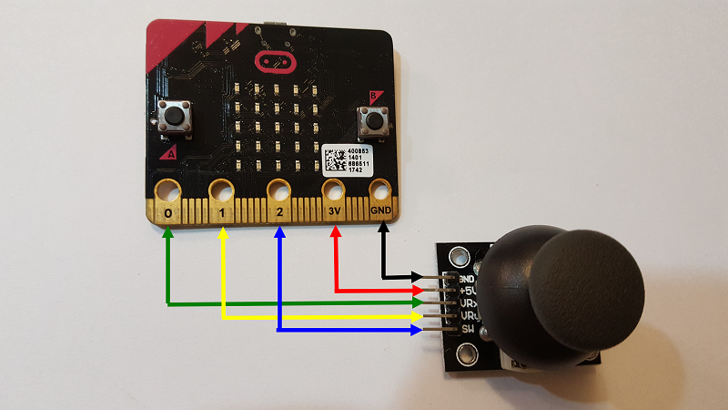
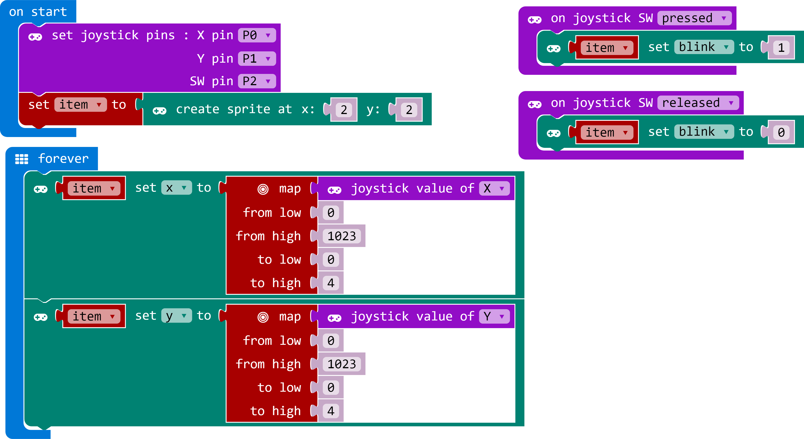

# joystick

這是專為micro:bit提供的搖桿積木
This is the JoyStick blocks for micro:bit

## Circuit


## Sample1

## Sample2


## License

* MIT

## Supported targets

* for PXT/microbit
(The metadata above is needed for package search.)

```package
joystick=github:lioujj/pxt-joystick
```
